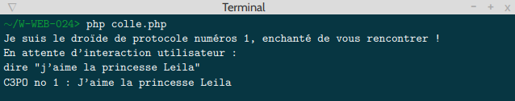

	 
	
	 

<h1>COMPÉTENCES À ACQUÉRIR :</h1>

Voici la liste des compétences à acquérir :

<ul>
<li>PHP</li>
<li>Algorithmie</li>
<li>User inputs</li>
<li>Parsing</li>
</ul>

<!----------------------------------------------------------------------------------------->

<h1>ETAPE 1 :</h1>

Vous devez créer une classe C3PO qui héritera d’une classe Robot fournie en soutenance.

La classe C3PO possédera un attribut protégé « numeroDeSerie ». Ce numéro sera incrémenté à chaque
instanciation d’un C3PO.

La classe C3PO possédera deux attributs privé « nom » et « type ». Ces attributs devront être modifiables
en dehors de la classe. L’attribut « type » devra prendre la valeur « droide de protocole »
par défaut.

L’attribut « nom » devra être fourni à l’instanciation de la classe.

Lors de l’instanciation de la classe, C3PO devra dire « Je suis le droïde de protocole numéro [numeroDeSerie], enchanté de vous rencontrer ! » suivi d’un retour à la pgne.

La classe C3PO devra posséder deux méthodes publiques :

<ul>
<li>Une méthode « dire » qui prend en paramètre une chaîne de caractère « str », et qui affiche « C3PO no
[numeroDeSerie] : [str] » suivi d’un retour à la ligne. Cette méthode ne renvoie rien.</li>
<li> Une méthode « marcher » qui ne prend pas de paramètre, et qui affiche « Je me mets en route, inutile
d’insister. » suivi d’un retour à la ligne. Cette méthode ne renvoie rien. Cette méthode devra appeler la
méthode parente de la classe C3PO.</li>
</ul>

<!----------------------------------------------------------------------------------------->

<h1>ETAPE 2 :</h1>

Vous devez créer une méthode « initierProtocole » qui ne prend pas de paramètre. Cette méthode devra
afficher « En attente d’interaction utilisateur : » suivi d’un retour à la ligne. Puis cette méthode devra lire
l’entrée standard. Cette méthode devra ensuite appeler la méthode de C3PO (ou de sa classe parente)
correspondant à la commande tapée par l’utilisateur.

Exemple :

<!----------------------------------------------------------------------------------------->

<h1>ETAPE 3 :</h1>

Vous devez faire en sorte de permettre à C3PO d’exécuter un nombre infini d’instructions dans la méthode
« initierProtocole ». L’utilisateur pourra sortir de la méthode en tapant l’instruction « repos ». La méthode
devra alors afficher « Fin du protocole ».

Exemple :

